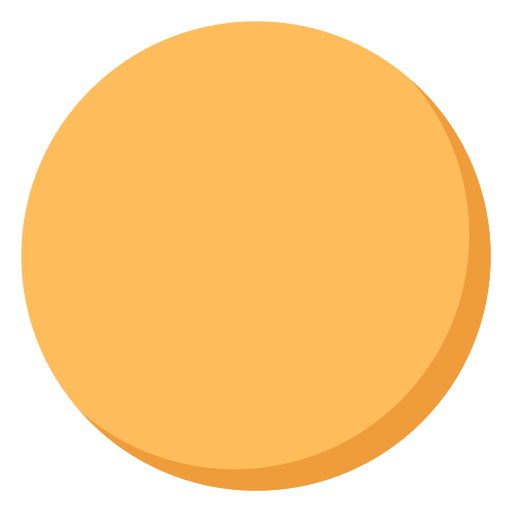

# Connect 4

## Getting started

I was looking for some game to recreate with swift and found connect 4. It is quite interesting due to solving algorithm and the challenge that implies a good UI.

**About this game**

A two-player connection board game, in which the players choose a color and then take turns dropping colored tokens into a seven-column, six-row vertically suspended grid. The pieces fall straight down, occupying the lowest available space within the column. The objective of the game is to be the first to form a horizontal, vertical, or diagonal line of four of one's own tokens. Connect Four is a solved game. The first player can always win by playing the right moves.

## Screenshots and video

Menu             |  Game           | Video
:-------------------------:|:-------------------------:|:-------------------------:
  |   |  

 

## Solving algorithm

From Wikipedia:

> Connect Four is a two-player game with perfect information for both sides, meaning that nothing is hidden from anyone. Connect Four also belongs to the classification of an adversarial, zero-sum game, since a player's advantage is an opponent's disadvantage.

> One measure of complexity of the Connect Four game is the number of possible games board positions. For classic Connect Four played on a 7-column-wide, 6-row-high grid, there are 4,531,985,219,092 positions[5] for all game boards populated with 0 to 42 pieces.

This is really important when it comes to check if one player has won. There are 4 different directions that must be checked. Each one with it is one complexity

```swift
// So we have to solve 4 different directions and for all of them check if is inside limit

func solveHorizontal() {}

func solveVertical() {}

func solveDiagonalIncreasing() {}

func solveDiagonalDecreasing() {}

```

All the data will be stored in a bidimensional array of 7 columns 6 rows. Example of 5 firsts moves


```swift
// Original array

[0,0,0,0,0,0,0]
[0,0,0,0,0,0,0]
[0,0,0,0,0,0,0]
[0,0,0,0,0,0,0]
[0,0,0,0,0,0,0]
[0,0,0,0,0,0,0]

//Player 1 move
[0,0,0,0,0,0,0]
[0,0,0,0,0,0,0]
[0,0,0,0,0,0,0]
[0,0,0,0,0,0,0]
[0,0,0,0,0,0,0]
[0,1,0,0,0,0,0]

//Player 2 move
[0,0,0,0,0,0,0]
[0,0,0,0,0,0,0]
[0,0,0,0,0,0,0]
[0,0,0,0,0,0,0]
[0,0,0,0,0,0,0]
[0,1,2,0,0,0,0]

//Player 1 move
[0,0,0,0,0,0,0]
[0,0,0,0,0,0,0]
[0,0,0,0,0,0,0]
[0,0,0,0,0,0,0]
[0,0,0,0,0,0,0]
[0,1,2,2,0,0,0]

//Player 2 move
[0,0,0,0,0,0,0]
[0,0,0,0,0,0,0]
[0,0,0,0,0,0,0]
[0,0,0,0,0,0,0]
[0,1,0,0,0,0,0]
[0,1,2,2,0,0,0]
```


## Resources

Chip red             |  Chip yellow           |  Connect 4 board
:-------------------------:|:-------------------------:|:-------------------------:
  |   |  

 


## License
[MIT](https://choosealicense.com/licenses/mit/)